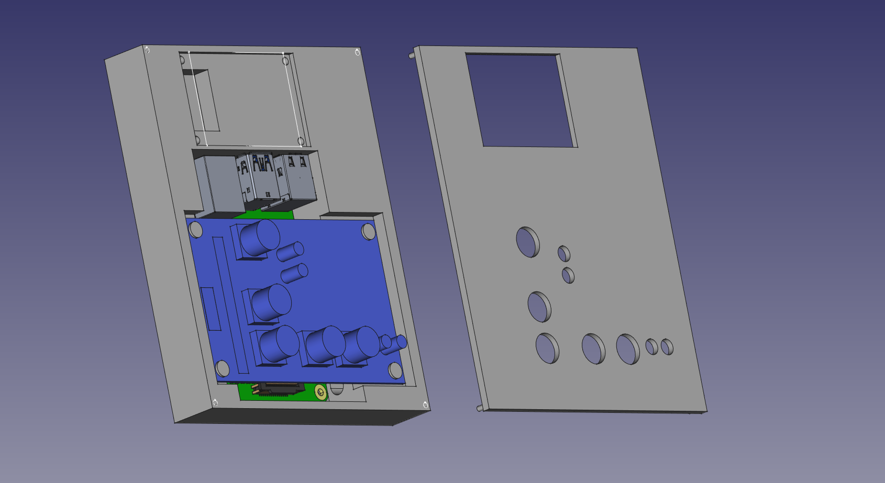

[![Contributors][contributors-shield]][contributors-url]
[![Forks][forks-shield]][forks-url]
[![Stargazers][stars-shield]][stars-url]
[![Issues][issues-shield]][issues-url]
[![LinkedIn][linkedin-shield]][linkedin-url]

<!-- PROJECT LOGO -->
 

  

  <h3 align="center">Marketplace Ad Poster</h3>

  

     
    <a href="https://github.com/MikeSimpson1/AdPoster"><strong>Explore the docs »</strong></a>
     
     
    <a href="https://github.com/MikeSimpson1/AdPoster">View Demo</a>
    ·
    <a href="https://github.com/MikeSimpson1/AdPoster/issues">Report Bug</a>
    ·
    <a href="https://github.com/MikeSimpson1/AdPoster/issues">Request Feature</a>
  

<!-- TABLE OF CONTENTS -->

  
Table of Contents

  <ol>
    <li>
      <a href="#about-the-project">About The Project</a>
      <ul>
        <li><a href="#built-with">Built With</a></li>
      </ul>
    </li>
  </ol>

<!-- ABOUT THE PROJECT -->
## About The Project

[![Product Name Screen Shot][product-screenshot]](https://example.com)

Lorem ipsum

(<a href="#readme-top">back to top</a>)

### Built With

* [![Python][Python]][Python-url]
* [![Selenium][Selenium]][Selenium-url]
* [![OpenCV][OpenCV]][OpenCV-url]

(<a href="#readme-top">back to top</a>)

<!-- MARKDOWN LINKS & IMAGES -->
[contributors-shield]: https://img.shields.io/github/contributors/MikeSimpson1/AdPoster.svg?style=for-the-badge
[contributors-url]: https://github.com/MikeSimpson1/AdPoster/graphs/contributors
[forks-shield]: https://img.shields.io/github/forks/MikeSimpson1/AdPoster.svg?style=for-the-badge
[forks-url]: https://github.com/MikeSimpson1/AdPoster/network/members
[stars-shield]: https://img.shields.io/github/stars/MikeSimpson1/AdPoster.svg?style=for-the-badge
[stars-url]: https://github.com/MikeSimpson1/AdPoster/stargazers
[issues-shield]: https://img.shields.io/github/issues/MikeSimpson1/AdPoster.svg?style=for-the-badge
[issues-url]: https://github.com/MikeSimpson1/AdPoster/issues
[license-shield]: https://img.shields.io/github/license/MikeSimpson1/AdPoster.svg?style=for-the-badge
[license-url]: https://github.com/MikeSimpson1/AdPoster/blob/master/LICENSE.txt
[linkedin-shield]: https://img.shields.io/badge/-LinkedIn-black.svg?style=for-the-badge&logo=linkedin&colorB=555
[linkedin-url]: https://linkedin.com/in/mike-simpson-86237419a/
[product-screenshot]: ProductImages/Uncased_device.jpg
[Selenium]: https://img.shields.io/pypi/pyversions/Selenium?logo=Selenium
[Selenium-url]: https://www.selenium.dev/
[Python]: https://img.shields.io/pypi/pyversions/pybadges.svg
[Python-url]: https://www.python.org/
[OpenCV]: https://img.shields.io/pypi/pyversions/Opencv-python?logo=OpenCV
[OpenCV-url]: https://pypi.org/project/opencv-python/